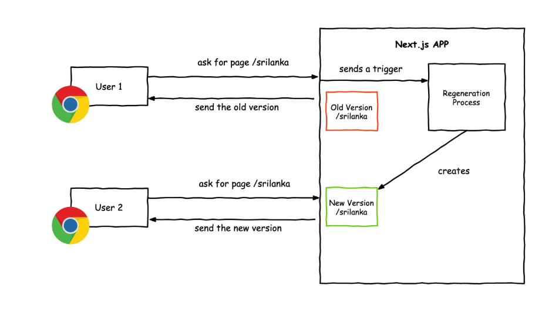

# Différents types de rendering

## SSR (Server-Side Rendering)

Sur ce type de rendering, c'est le serveur qui doit construire la page, par exemple : 
- le client envoie une requête GET
- le serveur se charge de construire la vue avec toutes les données déjà injectées comme des par exemple des données nécessitant des appels à une DB.
- le serveur retourne un fichier HTML avec tout le contenu et ses ressources externes (css, js, images etc.)
- le navigateur reçoit la page et charge les ressources

En **SSR** c'est le serveur qui fait tout le travail.

### Avantages : 
- **SEO friendly**, comme toutes les données sont déjà chargées les navigateurs peuvent tout lire sans devoir attendre une requête asynchrone par exemple
- Performance plus élévée, il ya moins de requêtes http et le temps de chargement est plus court comme le client reçoit tout le contenu prêt, il n'a pas à charger des ressources en plus après réception

### Inconvénients : 
Qui dit chargement côté serveur dit charge plus conséquente côté serveur.

### SSR sur Next.JS

Next.JS propose le SSR, pour l'utiliser, il faut sur une page ou un composant, exporter une fonction
asynchrone qui fetch de la data.
Comme le montre l'exemple sur la documentation : [SSR Next.JS](https://nextjs.org/docs/pages/building-your-application/rendering/server-side-rendering)

### SSR sur le projet

Dans ce projet, les pages /room/[roomName] sont générées en SSR, le contenu dans les rooms est dynamique,
on a besoin quand on rentre dans une rooms d'avoir tout les messages, d'où le rendu initial en SSR

## SSG (Static Site Generation)

Le SSG génère les pages HTML lors du build puis elles sont stockées ce qui permet de les envoyer directement
au client sans avoir besoin de les charger à chaque appel.

En général sur une application les pages qui sont générées en static sont celles qui n'auront pas de changement de contenu fréquent.

**Le build** va transfromer les fichiers et ressources du site en un ensemble prêt à être utiliser en production. Son but est de booster les performances
en envoyant des pages prêtes à l'emploi et minimisées.

### Avantages

- Chargement rapide, les pages sont déjà générées à l'avance
- Potentiel attaques réduits, comme les pages sont générées, il n'y a pas d'exécution de code et moins de risque d'attaque
- Infrastructure plus légère, les sites en SSG peuvent être hébergés sur de solutions spécialisée et légère fait pour le SSG ([Netlify](https://www.netlify.com/))

### Inconvénients

- interactivité pauvre, la page est statique donc les interactions avec l'utilisateur sont moindre mais possible
- Mis à jour, comme le contenu est statique, il n'est pas forcément à jour à l'instant T
- Le build peut être long, selon la taille et la façon dont le site est géré le build peut empêcher la connexion au site

Le SSG rend un site facile à déployer et offre une grande performance selon le but du projet grâce à la génération du contenu au moment du build.

## SSG sur Next.JS

Une page en rendu SSG sur Next.JS est simplement une page ou composant sans données, ou alors
des données sont nécessaires et dans ce cas-là, il faut dans le même fichier une fonction async qui sera exécuté au moment du build,
voici un exemple de syntaxe pour le faire :
```
props: {
      posts,
    },
```
[SSG sur Next.JS](https://nextjs.org/docs/pages/building-your-application/rendering/static-site-generation)

Le SSG est aussi **SEO friendly**, le HTML complet est disponible immédiatement et le temps de chargement est très rapide.


## ISR (Incremental-Side Rendering)

L'ISR est un mélange de génération statique et rendu dynamique.

La navigateur télécharge la page HTML avec un mimimum d'informations ainsi que le javascript
puis le javascript va mettre à jour le DOM, c'est pour cette raison que sur certains sites il y a du changement à l'arrivée
sur une page.

Il affiche aussi instantanément la nouvelle version d'une page quand quelqu'un la demande.



([source](https://arunoda.me/blog/what-is-nextjs-issg))

### Avantages

- réduction du temps de build
- Meilleure expérience utilisateur
- Mise à jour de contenu instantanées
- économie de ressource côté serveur


## Inconvénient

- Complexité accrue
- Expérience utilisateur compliquée, c'est pratique mais il faut maîtriser l'ISR pour que l'utilisateur ne soit pas surpris par des changements brusque


Au niveau référencement (SEO), les trois sont très bien et tout dépends du contexte. Le plus optimisé
reste le SSG qui envoie la page entière déjà prête contrairement au SSR qui lui la construit avant de l'envoyer ou encore l'ISR où il pourrait manquer
des éléments de la page qui arrivent au fur et à mesure.

Il vaut mieux faire du SSR ou SSG si on veut vraiment optimiser le SEO afin que les navigateurs puissent le référencer au mieux,
mais, tout dépend du contexte de l'application, l'ISR peut être très bien aussi, cela dépend du contenu qui est ajouté dynamiquement.